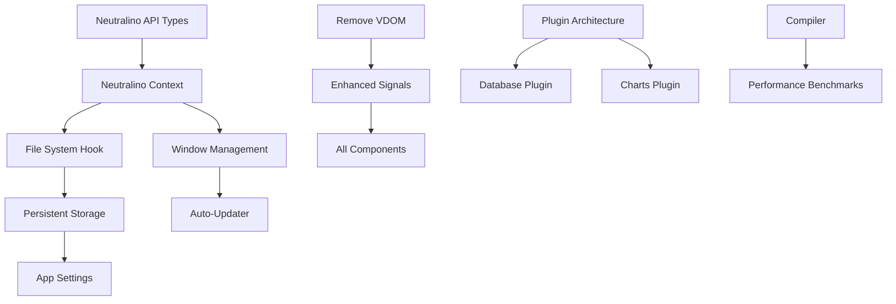

# 39.ts Neutralino.js Specialization - Complete Task Board

## 🎯 Board Overview

This board outlines the complete transformation of 39.ts into the definitive Neutralino.js framework. Tasks are organized by phase with detailed specifications for both human developers and AI agents.

---

## 📋 Short Term Tasks (0-3 months)

| Task ID | Name | User Story | Effort | Component | Dependencies Missing | Dependencies Affected | Acceptance Criteria |
|---------|------|------------|--------|-----------|-------------------|-------------------|-------------------|
| **ST-001** | **Neutralino API Type Definitions** | As a developer, I want fully typed Neutralino.js APIs so that I can use them with complete TypeScript safety | 5 days | `39.ts-neutralino/api/` | None | None | • All Neutralino APIs have TypeScript definitions • 100% API coverage with proper return types • JSDoc documentation for all methods • Unit tests for type safety |
| **ST-002** | **Core Neutralino Context Provider** | As a developer, I want a centralized context for Neutralino state so that all components can access platform capabilities | 3 days | `39.ts-neutralino/context/` | ST-001 | `39.ts-core` | • `NeutralinoProvider` component created • Context includes `isNeutralino`, `ready`, `version` state • Proper initialization lifecycle • Error handling for missing Neutralino |
| **ST-003** | **File System Hook** | As a developer, I want a simple hook for file operations so that I can read/write files without boilerplate | 4 days | `39.ts-neutralino/hooks/` | ST-001, ST-002 | None | • `useFileSystem()` hook with all file operations • Type-safe file reading/writing • Error handling and validation • Support for binary and text files |
| **ST-004** | **Window Management Hook** | As a developer, I want to control window properties so that I can create proper desktop application experiences | 3 days | `39.ts-neutralino/hooks/` | ST-001, ST-002 | None | • `useWindowState()` hook for window control • Window positioning, sizing, minimizing • Full-screen and always-on-top support • Window event listeners |
| **ST-005** | **Remove Virtual DOM System** | As a framework user, I want faster rendering so that my desktop apps are more responsive | 8 days | `39.ts-core/dom/` | None | All existing components | • Direct DOM manipulation instead of VDOM • Signal-to-DOM binding system • Backward compatibility layer • Performance benchmarks show 40%+ improvement |
| **ST-006** | **Enhanced Signal System** | As a developer, I want complete reactive primitives so that I can build complex state interactions | 6 days | `39.ts-core/signals/` | ST-005 | All components using signals | • `createEffect()` for side effects • `batch()` for grouped updates • `createResource()` for async data • Memory leak prevention |
| **ST-007** | **Desktop MenuBar Component** | As a desktop app developer, I want a native-style menu bar so that my app follows OS conventions | 4 days | `39.ts-desktop-components/layout/` | ST-002, ST-003 | None | • MenuBar component with native styling • Keyboard shortcut registration • Nested menu support • Platform-specific styling |
| **ST-008** | **Desktop Toolbar Component** | As a developer, I want a customizable toolbar so that I can provide quick access to common actions | 3 days | `39.ts-desktop-components/layout/` | ST-007 | None | • Toolbar component with icon support • Grouping and separators • Overflow handling • Drag & drop reordering |
| **ST-009** | **File Drop Zone Component** | As a user, I want to drag files into the app so that I can easily import content | 5 days | `39.ts-desktop-components/input/` | ST-003 | None | • FileDropZone component • Multiple file support • File type validation • Visual drop indicators |
| **ST-010** | **Enhanced CLI Templates** | As a developer, I want desktop-specific project templates so that I can quickly start building Neutralino apps | 6 days | `39.starter/templates/` | ST-002, ST-007 | `39.starter` CLI | • Desktop-only template • Hybrid (web+desktop) template • Component generator commands • Neutralino configuration automation |
| **ST-011** | **Desktop App Documentation** | As a developer, I want comprehensive guides so that I can learn desktop development patterns | 4 days | Documentation | All previous tasks | None | • Getting started guide • Desktop patterns documentation • API reference • Migration guide from web frameworks |
| **ST-012** | **Basic Testing Infrastructure** | As a contributor, I want proper testing setup so that I can ensure code quality | 3 days | Testing setup | None | All packages | • Vitest configuration • Neutralino API mocking • Component testing utilities • CI/CD pipeline setup |

---

## 🛠 Medium Term Tasks (3-9 months)

| Task ID | Name | User Story | Effort | Component | Dependencies Missing | Dependencies Affected | Acceptance Criteria |
|---------|------|------------|--------|-----------|-------------------|-------------------|-------------------|
| **MT-001** | **Persistent Storage Hook** | As a developer, I want data to persist between app sessions so that user preferences are remembered | 4 days | `39.ts-neutralino/hooks/` | ST-003 | None | • `usePersistedSignal()` hook • localStorage and userData storage options • Automatic serialization/deserialization • Migration support for data format changes |
| **MT-002** | **App Settings Management** | As a developer, I want a standardized settings system so that I can manage user preferences easily | 5 days | `39.ts-neutralino/hooks/` | MT-001 | None | • `createAppSettings()` utility • Type-safe settings schema • Default values and validation • Settings UI generator |
| **MT-003** | **Auto-Updater Integration** | As a user, I want automatic app updates so that I always have the latest features | 8 days | `39.ts-neutralino/hooks/` | ST-004 | None | • `useAutoUpdater()` hook • Update checking and downloading • Progress tracking • Rollback capabilities |
| **MT-004** | **System Tray Support** | As a user, I want the app to minimize to system tray so that it doesn't clutter my taskbar | 6 days | `39.ts-neutralino/hooks/` | ST-004 | None | • `useSystemTray()` hook • Tray icon and menu • Click handlers • Notification integration |
| **MT-005** | **Hot Reload Development Server** | As a developer, I want hot reload during development so that I can see changes instantly | 10 days | `39.ts-dev-tools/hot-reload/` | ST-010 | All development workflows | • Development server with hot reload • Neutralino integration • File watching and change detection • Error overlay in development |
| **MT-006** | **In-App Debug Panel** | As a developer, I want debugging tools in the app so that I can inspect state and performance | 7 days | `39.ts-dev-tools/debugger/` | ST-006 | Development mode | • DevPanel component for debugging • Signal state inspection • Component tree visualization • Performance monitoring |
| **MT-007** | **Advanced Data Grid Component** | As a developer, I want a high-performance data grid so that I can display large datasets efficiently | 12 days | `39.ts-desktop-components/display/` | ST-006 | None | • DataGrid component with virtual scrolling • Sorting and filtering • Column resizing and reordering • Export functionality |
| **MT-008** | **File Explorer Component** | As a user, I want a built-in file browser so that I can navigate and select files within the app | 10 days | `39.ts-desktop-components/input/` | ST-003, MT-007 | None | • FileExplorer component • Tree view and list view modes • File type icons and previews • Context menu integration |
| **MT-009** | **Code Editor Component** | As a developer, I want a syntax-highlighted editor so that I can build development tools | 15 days | `39.ts-desktop-components/input/` | External: Monaco Editor | None | • CodeEditor component wrapper • Syntax highlighting for common languages • Find/replace functionality • Themes and customization |
| **MT-010** | **Window Manager System** | As a developer, I want multi-window support so that I can create complex desktop applications | 12 days | `39.ts-neutralino/hooks/` | ST-004 | Window-related components | • `useWindowManager()` hook • Child window creation • Inter-window communication • Window lifecycle management |
| **MT-011** | **Split Pane Component** | As a user, I want resizable panels so that I can customize the interface layout | 6 days | `39.ts-desktop-components/layout/` | None | Layout components | • SplitPane component with resizing • Horizontal and vertical splitting • Minimum size constraints • Nested splitting support |
| **MT-012** | **Context Menu System** | As a user, I want right-click menus so that I can access contextual actions | 5 days | `39.ts-desktop-components/feedback/` | ST-007 | All interactive components | • ContextMenu component • Right-click event handling • Nested menu support • Keyboard navigation |
| **MT-013** | **Advanced CLI Commands** | As a developer, I want powerful CLI tools so that I can manage my project efficiently | 8 days | `39.starter/commands/` | ST-010 | CLI workflow | • `add-component` command • `add-native-feature` command • Project analysis and optimization • Dependency management |
| **MT-014** | **Build Optimization System** | As a developer, I want optimized builds so that my app has minimal size and maximum performance | 10 days | `39.ts-dev-tools/build/` | ST-005, ST-006 | Build pipeline | • Tree shaking optimization • Dead code elimination • Bundle size analysis • Production build optimizations |
| **MT-015** | **Plugin Architecture Foundation** | As a developer, I want to extend the framework so that I can add custom functionality | 12 days | `39.ts-core/plugins/` | All medium-term tasks | Framework extensibility | • Plugin interface definition • Plugin lifecycle management • Plugin discovery and loading • API hooks for plugins |

---

## 🎯 Long Term Tasks (9-18 months)

| Task ID | Name | User Story | Effort | Component | Dependencies Missing | Dependencies Affected | Acceptance Criteria |
|---------|------|------------|--------|-----------|-------------------|-------------------|-------------------|
| **LT-001** | **Database Plugin** | As a developer, I want database integration so that I can build data-driven applications | 15 days | `@39ts/database` plugin | MT-015 | None | • SQLite integration plugin • ORM-like query builder • Migration system • Connection pooling |
| **LT-002** | **Charts Plugin** | As a developer, I want data visualization so that I can create analytical applications | 12 days | `@39ts/charts` plugin | MT-015 | None | • Chart.js integration plugin • Reactive chart components • Multiple chart types • Export functionality |
| **LT-003** | **Terminal Emulator Component** | As a developer, I want an embedded terminal so that I can build development tools | 20 days | `39.ts-desktop-components/advanced/` | MT-009 | None | • TerminalEmulator component • Command execution • ANSI color support • Command history |
| **LT-004** | **Advanced Template System** | As a developer, I want project templates for common app types so that I can start projects quickly | 10 days | `39.starter/templates/` | MT-013 | CLI templates | • Code editor template • File manager template • Media player template • Dashboard template |
| **LT-005** | **Compiler Optimization Engine** | As a developer, I want compile-time optimizations so that my app has zero runtime overhead | 25 days | `39.ts-compiler/` | ST-005, ST-006 | Entire framework | • Signal compilation to direct DOM updates • Dead code elimination • Component inlining • Bundle size reduction of 60%+ |
| **LT-006** | **Advanced Plugin Management** | As a developer, I want easy plugin management so that I can extend functionality without complexity | 8 days | `39.starter/commands/` | MT-015, LT-001, LT-002 | Plugin ecosystem | • `plugin add/remove` commands • Plugin dependency resolution • Plugin marketplace integration • Version compatibility checking |
| **LT-007** | **Deployment Automation** | As a developer, I want automated deployment so that I can distribute my app easily | 12 days | `39.starter/commands/` | MT-014 | Build and packaging | • `build --target=platform` command • Installer generation • Code signing integration • Release automation |
| **LT-008** | **Property Inspector Component** | As a developer, I want object property editing so that I can build admin interfaces | 8 days | `39.ts-desktop-components/advanced/` | MT-012 | Form components | • PropertyInspector component • Dynamic form generation • Type-aware input fields • Validation integration |
| **LT-009** | **Advanced Virtual Scrolling** | As a developer, I want high-performance lists so that I can display thousands of items smoothly | 10 days | `39.ts-desktop-components/performance/` | ST-006 | List components | • VirtualList component • Variable height items • Horizontal scrolling • Smooth scrolling performance |
| **LT-010** | **Framework Performance Benchmarking** | As a maintainer, I want performance metrics so that I can ensure framework competitiveness | 6 days | `39.ts-benchmarks/` | LT-005 | Framework core | • Benchmark suite vs other frameworks • Memory usage profiling • Startup time measurements • Automated performance regression testing |
| **LT-011** | **Community Plugin Ecosystem** | As a developer, I want access to community plugins so that I can leverage shared solutions | 8 days | Plugin marketplace | LT-006 | Plugin architecture | • Plugin marketplace website • Plugin submission process • Quality guidelines • Community moderation |
| **LT-012** | **Enterprise Features** | As an enterprise developer, I want advanced features so that I can build mission-critical applications | 20 days | `39.ts-enterprise/` | All previous tasks | Framework architecture | • SSO integration • Audit logging • Role-based access control • Enterprise support tier |
| **LT-013** | **Framework Migration Tools** | As a developer, I want migration assistance so that I can move existing apps to 39.ts | 15 days | `39.ts-migrate/` | Framework stability | Existing frameworks | • React migration tool • Vue migration tool • Electron migration guide • Automated code transformation |
| **LT-014** | **Advanced Testing Framework** | As a developer, I want comprehensive testing tools so that I can ensure app quality | 12 days | `39.ts-testing/` | All components | Testing ecosystem | • E2E testing framework • Visual regression testing • Performance testing tools • Accessibility testing |
| **LT-015** | **Documentation Platform** | As a developer, I want excellent documentation so that I can learn and use the framework effectively | 10 days | Documentation site | All framework features | None | • Interactive documentation site • Live code examples • Tutorial series • API reference generator |

---

## 📊 Phase Summary

### Short Term (0-3 months) - Foundation
**Total Tasks:** 12 | **Total Effort:** 52 days | **Focus:** Core Neutralino integration and basic desktop components

**Key Deliverables:**
- Complete Neutralino.js API integration
- Direct DOM rendering system
- Essential desktop UI components
- Enhanced CLI with desktop templates

### Medium Term (3-9 months) - Advanced Features
**Total Tasks:** 15 | **Total Effort:** 127 days | **Focus:** Developer experience and advanced desktop features

**Key Deliverables:**
- Hot reload and debugging tools
- Advanced components (DataGrid, FileExplorer, CodeEditor)
- Plugin architecture foundation
- Build optimization system

### Long Term (9-18 months) - Ecosystem
**Total Tasks:** 15 | **Total Effort:** 195 days | **Focus:** Complete ecosystem and market dominance

**Key Deliverables:**
- Compiler optimizations
- Community plugin marketplace
- Enterprise features
- Migration tools and comprehensive documentation

---

## 🔄 Dependencies Flow Chart

---

## 💡 AI Agent Specific Instructions

### Task Execution Order
1. **Always complete Short Term tasks before Medium Term**
2. **Dependencies must be resolved before dependent tasks**
3. **Test infrastructure (ST-012) should be completed early**
4. **Documentation tasks can be executed in parallel with development**

### Code Generation Guidelines
- **Follow the established package structure**
- **Use TypeScript strict mode**
- **Include comprehensive JSDoc documentation**
- **Generate corresponding test files**
- **Follow the coding conventions from project instructions**

### Quality Gates
- **Each task must include unit tests**
- **Documentation must be updated**
- **Performance impact must be measured**
- **Backward compatibility must be maintained during transitions**

This board provides a comprehensive roadmap for transforming 39.ts into the definitive Neutralino.js framework, with clear deliverables, dependencies, and success criteria for both human and AI development.